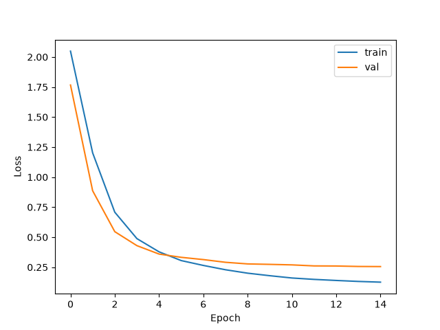

# Quantized Image Classification with ResNet-18

A ResNet-18 fine-tuned on CIFAR-10, starting from ImageNet pretrained weights. Since CIFAR-10 images are only 32×32 (smaller than the 224×224 ImageNet expects), I changed the model slightly: the first conv is 3×3 with stride 1 instead of the usual 7×7 stride 2, and the initial maxpool is removed. This ensures that the model doesn't shrink the already smaller CIFAR-10 images. Otherwise it's a standard fine-tune, with the final layer swapped to output 10 classes instead of 1000.

Training ran for 15 epochs with SGD (momentum 0.9, weight decay 5e-4), a cosine LR schedule with a 2-epoch warmup, and random crop and horizontal flip data augmentations. Inputs are normalized with ImageNet mean/std since that's what the pretrained model expects.

## Results

Fine-tuning loss curve:



| Model                                   | Size | Loss   | Accuracy |
| --------------------------------------- | ---- | ------ | -------- |
| PyTorch (`model_best.pt`)               | 43M  | 0.2554 | 91.64%   |
| Quantized ONNX (`model_quantized.onnx`) | 11M  | 0.2609 | 91.41%   |

Quantizing to int8 (static, QDQ format, calibrated on 200 training images) shrinks the model 4x for a 0.23-point drop in accuracy, which is a major efficiency gain.

## Reproduce

```bash
uv pip install -e .

# train: writes model_best.pt, model_last.pt, loss_curve.png to results/
python train/train.py

# export the trained model to ONNX
python train/export_onnx.py results/model_best.pt

# quantize the ONNX model to int8
python quantize/quantize.py

# check accuracy of a model, .pt or .onnx
python results/eval.py results/model_best.pt
python results/eval.py results/model_quantized.onnx

# check that PyTorch and ONNX agree on predictions
python results/verify_onnx.py results/model_best.pt --onnx results/model_quantized.onnx
```

## Files

- `model_best.pt` / `model_last.pt` — the PyTorch checkpoints (best val loss, and last epoch val loss)
- `model.onnx` / `model.onnx.data` — the exported ONNX graph and its weights (have to stay in the same dir)
- `model_quantized.onnx` — the int8 quantized model
- `eval.py` — loads model weights and reports loss/accuracy on the CIFAR-10 test set
- `verify_onnx.py` — runs the same batch through PyTorch and ONNX Runtime and checks they agree
